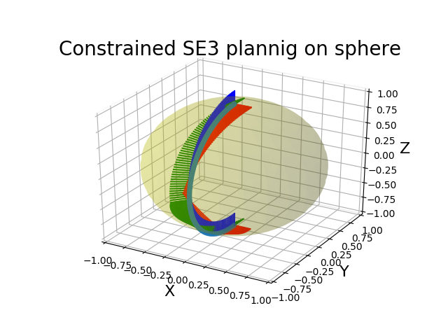

# OMPL Constrained planning on SE3

For constrained planning in OMPL, the state space has to satisfy some assumptions as described [in the documentation](https://ompl.kavrakilab.org/constrainedPlanning.html). In this repository I put some (ugly and incomplete) code I wrote while ago to create an SE3 state space that satisfies these assumptions. The default SE3 state space in OMPL is a compound state space that cannot be used for constrained planning.

I implemented it based the response from Zak Kingston on the [issue](https://bitbucket.org/ompl/ompl/issues/516/constrained-planning-for-compound-state) I posted in 2019. I never tested or used it in the end, so it could be full of bugs.

After having installed all the requirements for [ompl](https://github.com/ompl/ompl), you should be able to build this example in the usual cmake way:
```bash
mkdir build
cd build
cmake ..
make
```
and then running the `./constrained_se3_planning` target. This will write the interpolated path to a file `/build/path_se3.txt` which can be visualized with the Python script `plot_se3_path.py`. The python script requires the installation of `numpy`, `matplotlib` and `pyquaternion`.



